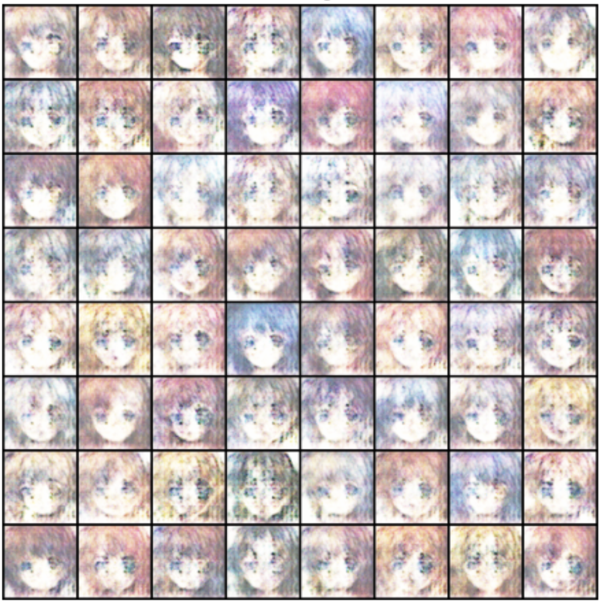
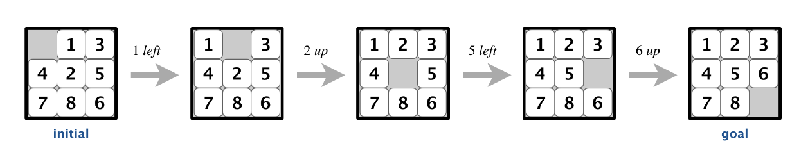
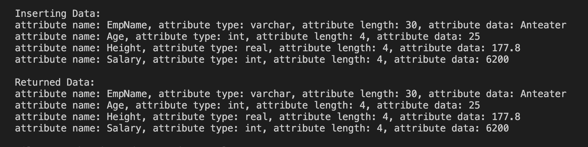
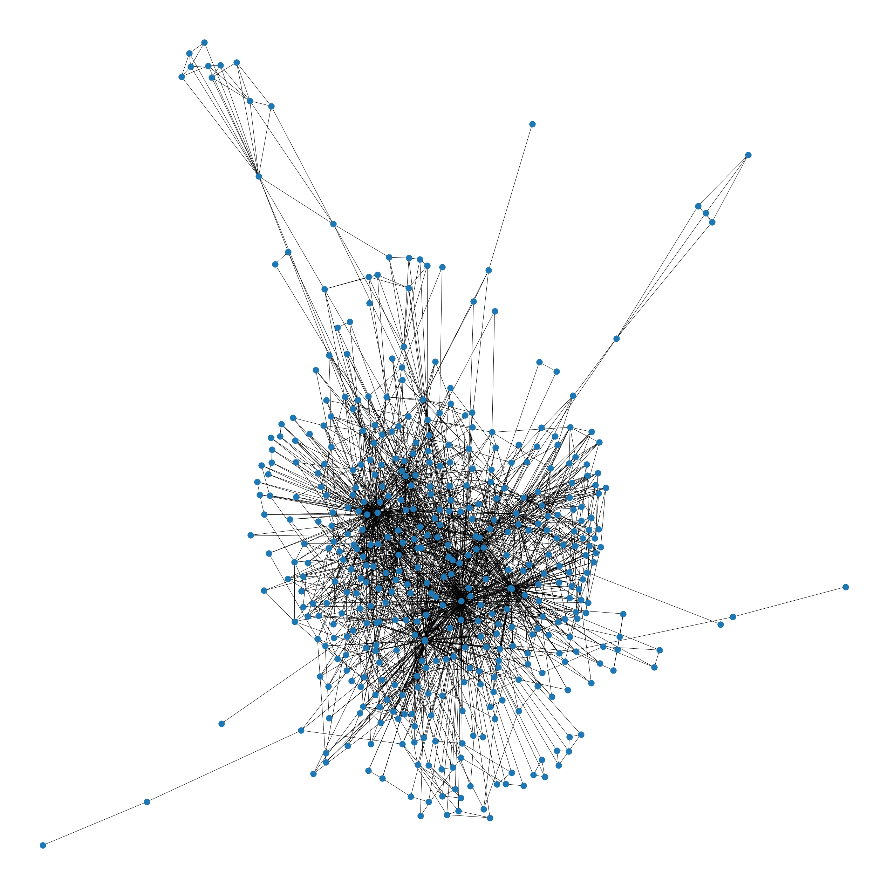

# About

I have experience in building high quality Software, AI Systems and Cloud Infrastructure— solving problems in Sustainability, Climate, Healthcare and Accessibility. I am pursuing Master's in Computer Science from Santa Clara University and will graduate in June 2024. I am super interested in HPC (Quantum, Parallel and Distributed Computing) and AI (Image and Language Models).

# Projects

## [Generative AI for Anime Characters](https://github.com/eshaanrathi2/Generative-AI-Anime)
<!-- -->

<!--  -->

## [IEEE INDICON Paper on Deep Learning + Benchmarking Computing Devices](https://ieeexplore.ieee.org/document/9691542)

Objective was to build an universally accessible AI system for Realtime Sign Language Recognition. For example the above image represents "friend" in Indian Sign Language.

## [Futurama: AI Puzzle Solver](https://github.com/eshaanrathi2/Futurama)

## [Fusion-DB: Time and Space efficient Database Engine](https://github.com/eshaanrathi2/Fusion-DB)

## [SocialX: Social Network Knowledge Graphs](https://github.com/eshaanrathi2/SocialX)
<!--  -->

Other Projects Include (didn't add version control):
- Twitter bot to make searching for medicines easier for people. Helped hundreds of people in Covid peak.

<!--  -->

<!--
**eshaanrathi2/eshaanrathi2** is a ✨ _special_ ✨ repository because its `README.md` (this file) appears on your GitHub profile.

Here are some ideas to get you started:

- 🔭 I’m currently working on ...
- 🌱 I’m currently learning ...
- 👯 I’m looking to collaborate on ...
- 🤔 I’m looking for help with ...
- 💬 Ask me about ...
- 📫 How to reach me: ...
- 😄 Pronouns: ...
- ⚡ Fun fact: ...
-->
